# Credit Scoring

*Created By*\
Natasha Sharma\
University at Albany, NY, USA\
E-mail: nsharma@albany.edu

### Abstract

The foundation of an organization's financing process is credit scoring. Credit rating falls within the same category as adopting technical advancements, given the widespread application of artificial intelligence in different industries. Combining machine learning and credit evaluation, adding rather extensive elements to the credit evaluation process is possible.\
Machine learning models and AI algorithms are employed in industries like education, healthcare, entertainment, and other domains. In this study, we primarily address the application of machine learning algorithms to credit scoring. We start by reviewing a few earlier studies examining machine learning models for predicting credit scores. Next, we examine multiple machine learning classification and deep learning models using the credit scoring dataset we got from Kaggle for this paper. Next, we cleaned the data by removing and encoding the variables and balanced the data to get better results. Then, we divided the dataset into a training and a test set. We performed ten machine-learning models in Python to get the performance metrics of each model.\
The results suggest that ensemble models, particularly Random Forest and XGBoost, are the best-performing models for this classification task, with their ability to capture intricate patterns and provide high accuracy across all classes.

**Keywords:** Artificial Intelligence; Machine Learning; Deep learning; Classification models.

### **1.	Introduction**
In today's financial environment, credit rating is vital and impacts many facets of personal and commercial finances. Financial institutions have paid enormous attention to the economic crises that occurred in the first two decades of the twenty-first century, particularly about credit risk. Nowadays, credit risk assessment and management are built around credit assessment. (Huang et al., 2007; Khatir & Bee, 2022) 

Several factors are considered while analyzing lending, a classic banking activity. Banks can determine whether borrowers will be able to repay the loan by using a credit scoring system to divide applicants into groups based on their capacity to meet financial responsibilities or good and bad credit quality.

According to Bolder's 2018 definition, a credit scoring model is typically characterized as a statistical model that estimates the likelihood that the counterparties in a credit portfolio will fail based on the values of the explanatory factors or features. Credit scores are frequently categorized into classes corresponding to rating categories; the rating denotes the creditworthiness level. Originally, credit score was decided upon based on individual judgment and subjectivity. Eventually, the "5Cs"—the consumer's character, capital, collateral, capacity, and economic conditions—were used as its foundation. (Khatir & Bee, 2022)

The process of credit scoring involves several steps. The general steps involved are as follows (Siddiqi, 2005): i) creating a statistical model using past data; ii) using the estimated model to determine the risk scores of possible lenders; iii) assessing the model's accuracy; and, lastly, iv) keeping an eye on business performance metrics. Selecting the statistical model is frequently seen as an essential decision. It influences the performance of a credit scoring system as a whole and all subsequent modeling efforts.

### 2.	Background/Literature Review
The Credit Score (CS) is an indicator that measures the likelihood that a borrower will continue to pose a "good" risk. (Kamimura et al., 2023) A credit score is a number that represents a person's creditworthiness. According to Abdou and Pointon (2011), credit scoring is a technique used by lenders to convert pertinent data into numerical measurements that inform credit choices. This process assists lenders in determining the potential risk of new clients and the future behavior of current ones. (Onay & Öztürk, 2018). Thus, customers whose credit score responds with a high probability of being a 'good' payer would be accepted, and the others rejected by Credit Score Models. (Kamimura et al., 2023).

Credit scoring models have been thoroughly studied and created to evaluate new applicants' credit approval. In the past, this issue was solved using statistical techniques like logistic regression (LR) (Wiginton, 1980) and linear discriminate analysis (LDA) (Altman, 1968). (Bao et al., 2019).

A credit scoring model offers a model-based estimate of a credit card customer's default likelihood, which can be used to anticipate the delinquency of that consumer. Machine learning classification algorithms for binary outcomes have been used to create predictive models for the default probability (Hand and Henley, 1997). The accuracy of alternative machine learning algorithms or classifiers has been the subject of numerous studies. (Teng & Lee, 2019).

According to data retrieved from the Board of Governors of the Federal Reserve System, which is the assets and liabilities of US commercial banks, the total amount of consumer credit loans held by US commercial banks in May 2013 was $1132.4 billion, while corporate business loans accounted for $1540.6 billion. Financial firms gather data on applicants and credit bureaus (such as monthly income, outstanding debt, geographic information, etc.) to evaluate the risk involved with money lending thoroughly. They then combine these data using a classification system to forecast borrowers' profitability or repayment patterns (Abdou & Pointon, 2011; Bequé & Lessmann, 2017).

Precise credit risk estimation is critical to an organization's profitability. If the bank fails to estimate a risk correctly, it either overprices loans and loses its market share or sets interest rates too low to cover the expected losses, which leads to poor financial results. (Markov et al., 2022). One of the key drivers of consumer credit defaults includes the adverse economic effects due to the COVID-19 pandemic and financial attitudes and behavior.

Big data also poses challenges, as evidenced by the recent Equifax data breach, in which hackers acquired the personal information of almost 143 million Americans. It presents risks to the security and privacy of personal data. (Onay & Öztürk, 2018).

(S. S. Sai et al.) developed a system for forecasting loan status using three classification techniques: logistic regression, decision trees, and random forest classifier. They arrived at a score of 79.86% after grading the predictions. (Vegh et al., 2023).

In order to forecast loan approvals, M. A. Sheikh et al.'s research employed a logistic regression model on a dataset of 1500 instances and ten numerical and eight categorical characteristics. 81.1% accuracy was attained. Y. (Divate et al.) used a support vector machine technique on the same dataset and came to a similar conclusion.

Four classification algorithms—logistic regression, decision trees, support vector machines, and random forests—were examined by N. Pandey et al. to forecast loan approvals. The most accurate result obtained by the support vector machine model was 79.67%. Shinde et al. employed a logistic regression model on more than 600 samples in a related study to forecast loan status. The model's greatest accuracy was approximately 82%.

Credit granting is usually regarded as a dynamic scenario. This makes it a complex decision-making issue that may compromise the survival of an organization. Thus, organizations are fundamentally responsible for assessing the risk of prospective borrowers before granting credit (Kamimura et al., 2023; Roy & Shaw, 2022).

Machine learning models and artificial intelligence algorithms can be used in several areas of industry, such as education, healthcare, entertainment, and others. Several studies have been done on finding credibility and credit risk management using different machine learning models. (Vegh et al., 2023).

This research aims to find the best machine learning and Deep learning model that can be used in financial institutions like banks to predict whether a credit score is good or poor. This study will contribute by helping businesses to carry out the correct credit score prediction, which will ultimately help in credit risk assessment, security of privacy, and other compliances.

#### 3.	Artificial Intelligence for Credit Scoring 
Credit scoring is one of the most critical aspects for financial institutions to consider when lending a loan. In this project, we have taken the dataset from Kaggle, and we will be running ten different classification models to find out which model performs best for predicting the credit scoring of the individuals in the dataset as Poor, Standard, and Good.

**Project Methods**

##### 3.1.1 Experimental Data:

The datasets employed for developing credit-scoring models should contain financial characteristics (Annual Income, Credit History Age, EMI per Month…..), behavioral information (Payment Behavior, Credit Utilization Ratio, . . . ), and categorical variables (Age, Occupation . . . ), which are the inputs of the model. 

This study used Credit Score Classification data downloaded from the Kaggle. The dataset initially contained 100,000 rows and 28 columns, which give information about the clients' financial status. After removing unwanted columns and outliers, cleaning and encoding, there were 100,000 rows and` 26 columns. 
 
In addition to the 26 features, the dataset contains the target variable Credit Score, coded as 0 for Good, 1 for Poor, and 2 for Standard credit score.

**Table : Description of all the features in the credit dataset.**

| No. | Column Name                | Description                                                                 |
|-----|----------------------------|-----------------------------------------------------------------------------|
| 1   | ID                         | An identifier for each record in the dataset.                               |
| 2   | Customer_ID                | Identifier for individual customers.                                        |
| 3   | Month                      | The month associated with the data entry.                                   |
| 4   | Age                        | Customer's age                                                              |
| 5   | Occupation                 | Customer's occupation or job title.                                         |
| 6   | Annual_Income              | Customer's annual income.                                                   |
| 7   | Monthly_Inhand_Salary      | The amount of money the customer receives as salary on a monthly basis.     |
| 8   | Num_Bank_Accounts          | Number of bank accounts the customer has.                                   |
| 9   | Num_Credit_Card            | Number of credit cards the customer possesses.                              |
| 10  | Interest_Rate              | The interest rate associated with some financial aspect (e.g., loans or credit cards). |
| 11  | Num_of_Loan                | Number of loans the customer has.                                           |
| 12  | Type_of_Loan               | The type of loan(s) the customer has (e.g., mortgage, personal loan, etc.). |
| 13  | Delay_from_due_date        | Delay in payments from the due date.                                        |
| 14  | Num_of_Delayed_Payment     | Number of delayed payments.                                                 |
| 15  | Changed_Credit_Limit       | Indicates if the customer has changed their credit limit.                   |
| 16  | Num_Credit_Inquiries       | Number of credit inquiries made by the customer.                            |
| 17  | Credit_Mix                 | The mix of different types of credit accounts (e.g., credit cards, loans).  |
| 18  | Outstanding_Debt           | The amount of outstanding debt.                                             |
| 19  | Credit_Utilization_Ratio   | The ratio of credit used to the total credit limit.                         |
| 20  | Credit_History_Age         | The age of the customer's credit history.                                   |
| 21  | Payment_of_Min_Amount      | Payment behavior regarding minimum required payments.                       |
| 22  | Total_EMI_per_month        | Total Equated Monthly Installment (EMI) payments made by the customer.      |
| 23  | Amount_invested_monthly    | The amount the customer invests on a monthly basis.                         |
| 24  | Payment_Behaviour          | Behavior related to payments, possibly indicating patterns or trends.       |
| 25  | Monthly_Balance            | The customer's monthly balance in their financial accounts.                 |
| 26  | Credit_Score               | The credit score associated with the customer's creditworthiness.           |


##### 3.1.2	Data Collection
This credit scoring project used data from Kaggle, a website that holds a number of data science competitions and datasets. The dataset consists of several attributes (columns) representing a distinct facet of a person's personal and financial life. These characteristics serve as the predictors of creditworthiness.

##### 3.1.3	Data Preprocessing
We are considering elements like outliers, missing values, inconsistent values and different data types to evaluate the data quality. Cleaning and preprocessing activities could be required to ensure the data is ready for modeling and analysis.

* Data Loading: The dataset was loaded using Pandas, and custom na_values were defined to handle missing or incorrect data representations.

* Initial Exploration: The dataset’s structure, including rows, columns, and data types, was analyzed using .head(), .shape, and .dtypes.


```python

import numpy as np
import pandas as pd
import matplotlib.pyplot as plt
import seaborn as sns
%matplotlib inline
import warnings, re, joblib

from sklearn.experimental import enable_iterative_imputer
from sklearn.impute import IterativeImputer, SimpleImputer
from sklearn.preprocessing import MinMaxScaler, StandardScaler, OrdinalEncoder, PowerTransformer, FunctionTransformer, OneHotEncoder, LabelEncoder
from sklearn.model_selection import cross_val_score

# Load data
data = pd.read_csv("path/to/train.csv", sep=",", na_values=['_','_______','#F%$D@*&8','!@9#%8','nan'])
data.head()


```

* Data Cleaning and Type Conversion
Dropping Irrelevant Columns: Columns irrelevant to model building, such as unique identifiers, were removed.

```python
data = data.drop(columns=["ID", "Name", "SSN"])
data.shape
```


* Changing Data Types: Text-based data was converted to numeric types (e.g., extracting numerical parts of strings) to facilitate modeling. For binary columns, mapping to boolean values was performed.

**Code**


```python
data["Month"] = pd.to_datetime(data['Month'], format='%B').dt.month
data["Age"] = data["Age"].str.extract("(\d+)").astype(int)
data["Num_of_Loan"] = data["Num_of_Loan"].str.extract("(\d+)").astype(int)
data["Num_of_Delayed_Payment"] = data["Num_of_Delayed_Payment"].str.extract("(\d+)").astype(float)
data["Annual_Income"] = data["Annual_Income"].str.extract(r'(\d+\.\d+)').astype(float)
data['Payment_of_Min_Amount'] = data['Payment_of_Min_Amount'].map({'yes': True, 'no': False}).astype(bool)
```

* Encoding Categorical Data: 
1.	Leave-One-Out Encoding: Applied to high-cardinality categorical features.
2.	Label Encoding: Applied to ordinal labels (e.g., Credit_Score) for efficient numeric representation

**Code**
```python
columns = ['Payment_Behaviour', 'Occupation', 'Credit_Mix', 'Type_of_Loan']
for item in columns:
    data[item] = ce.LeaveOneOutEncoder().fit_transform(data[item], data['Credit_Score'])

columns = ["Credit_Score"]
for item in columns:
    data[item] = LabelEncoder().fit_transform(data[item])
```
##### Handling Missing Values: Missing values were imputed using:

*	Mode for discrete features (e.g., Num_Credit_Inquiries),
*	Mean for continuous features (e.g., Monthly_Inhand_Salary).


**Code**

```python
data['Credit_History_Age'] = data['Credit_History_Age'].fillna('0 Years and 0 Months')
data['Credit_History_Age'] = data['Credit_History_Age'].apply(convert_to_months)

# Discrete columns: Mode imputation
discrete_columns = ['Num_of_Delayed_Payment', 'Num_Credit_Inquiries']
for col in discrete_columns:
    data[col].fillna(data[col].mode()[0], inplace=True)

# Continuous columns: Mean imputation
continuous_columns = ['Monthly_Inhand_Salary', 'Changed_Credit_Limit', 'Amount_invested_monthly', 'Monthly_Balance']
for col in continuous_columns:
    data[col].fillna(data[col].mean(), inplace=True)
```

##### Addressing Inconsistencies: Example
* Fixing Age Values:

**Code:**
```python
def clean_age(group):
min_age = group['Age'].min()
group['Age'] = group['Age'].apply(lambda x: min_age if x < 14 or x > 70 else x)
return group

data = data.groupby('Customer_ID').apply(clean_age).reset_index(drop=True)
```

* Fixing Annual Income:

**Code:**
```python
def replace_Annual_Income(group):
    min_income = group['Annual_Income'].min()
    group['Annual_Income'] = group['Annual_Income'].apply(lambda x: min_income if x > 0.2e+06 else x)
    return group
data = data.groupby('Customer_ID').apply(replace_Annual_Income).reset_index(drop=True)
```

* Feature Scaling:\
 Min-Max Scaling was applied to Credit_History_Age for normalization, ensuring values fall between 0 and 1.

**Code:**
```python
scaler = MinMaxScaler()
data['Credit_History_Age_Scaled'] = scaler.fit_transform(data[['Credit_History_Age']])
```

* Visualizing Outliers:\
 Violin plots were used to visualize the distribution of features, ensuring no extreme outliers remain.

**Code:**
 
```python
sns.set(style='whitegrid')
fig, axes = plt.subplots(5, 5, figsize=(20, 20), sharey=True)
axes = axes.flatten()
for i, feature in enumerate(data.select_dtypes(include=['number']).columns):
    sns.violinplot(x=data[feature], ax=axes[i], color=np.random.rand(3,))
plt.tight_layout()
plt.show()
```

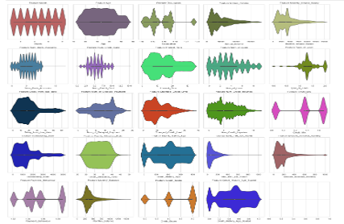

Each violin plot combines a box plot and a kernel density plot. This allows us to observe not only the spread of the data (as in a box plot) but also the distribution shape. The wider areas of the violins indicate where the data points are more concentrated.

**Most features have a compact range:** \
Features like Month, Age, Occupation, and Credit_Score show well-concentrated distributions without extreme long tails, indicating few or no major outliers.

**Few wider ranges or skewness:**
* Annual_Income: Shows some data points extending toward higher values, suggesting potential outliers. However, this might represent high earners and could still be valid.
* Num_of_Loan and Interest_Rate: Both have slightly wider distributions but lack any drastic tails, suggesting these are acceptable variations.
* Amount_invested_monthly: The data is relatively narrow in range, with no significant deviations.

**Clean distributions:** \
Features like Credit_History_Age_Scaled, Num_Bank_Accounts, and Num_Credit_Inquiries exhibit clean, symmetric distributions without extreme tails.\
From this plot, it is evident that while some features have wider ranges (e.g., Annual_Income), there are no highly pronounced anomalies that require removal.\
The existing transformations and group-wise adjustments have likely mitigated any significant irregularities, leaving the dataset in a reasonable shape.

### 4.  Visualization

1.	Understanding the distribution of the column - Age

    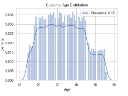

    The chart shows the distribution of customer ages in the dataset. It features a histogram with a kernel density estimate (KDE) overlay. The age distribution is approximately symmetrical, with a slight positive skewness of 0.16, as indicated in the legend. Most customers fall within the age range of 30 to 40 years, which marks the peak of the distribution. The ages span a broader range from approximately 10 to 60 years, with relatively fewer customers in the lower and higher ends of the age spectrum. This distribution suggests that the dataset predominantly represents young to middle-aged customers, which could have implications for credit behavior and risk assessment.

    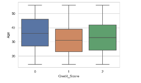

    This visualization is a boxplot that compares the distribution of customer ages across different credit score categories (0, 1, and 2). Customers with a credit score of 0 tend to be slightly older, with a median age of approximately 40 years, and a wider IQR. This indicates a more diverse age group among those with lower credit scores.
    For credit scores of 1 and 2, the median ages are slightly younger, around 35–38 years, with narrower IQRs, suggesting less variability in age.
    These trends highlight a possible relationship between age and credit score, where older individuals are more likely to have lower credit scores. This pattern could reflect differences in financial habits, credit utilization, or other demographic factors.
    
2.	Understanding the distribution of the column - Monthly_Inhand_Salary

    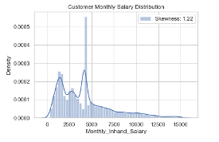

    The first chart displays the density plot of Monthly_Inhand_Salary for all customers in the dataset. The distribution is right-skewed, with a skewness value of 1.22, as highlighted in the plot. Most customers earn between 0 and 5,000 in monthly in-hand salary, with a noticeable spike around 4,500. This indicates that a significant portion of the population has relatively modest earnings, while higher salary levels are less frequent, explaining the skewness. The presence of long tails suggests that a few customers earn exceptionally high salaries, creating an extended range.

    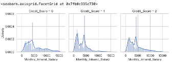

    This visualization breaks down the salary distribution by Credit_Score categories (0, 1, and 2). 
    * Credit_Score = 0: Customers with a credit score of 0 tend to have the lowest salary distribution among all groups, with a similar spike around 4,500. This suggests that customers in this group mostly belong to the lower earning population, which could potentially contribute to their poor credit scores.
    *	Credit_Score = 1: This group exhibits a slightly higher distribution of salaries compared to Credit_Score = 0. The density curve is similar but appears to have more customers earning moderate monthly in-hand salaries, between 2,000 and 5,000.
    *	Credit_Score = 2: Customers with the highest credit score (2) have a more spread-out salary distribution. While many customers in this group still earn between 2,000 and 5,000, the tail extends further, with more customers earning higher salaries compared to the other groups. This could indicate a correlation between higher earnings and better credit scores.
    
3.	Understanding the distribution of the column - Interest_Rate

    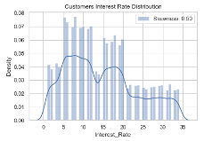

    The density plot shows the overall spread of interest rates that customers are subjected to, along with a histogram overlay. The skewness value of 0.50 indicates a slight right skew, but the distribution is relatively balanced.
    * Peak Density: Most customers experience interest rates between 5% and 20%, as evidenced by the density peaks in this range. The highest concentration appears to be near 10%-15%.
    * Longer Tail: While the majority of customers fall within the mid-range (5%-20%), there is a visible tail extending beyond 20%, with a few customers paying interest rates as high as 30%-35%. This tail contributes to the slight skewness observed in the data.
    * Gaps in Density: The plot reveals dips in the distribution, particularly around 15%-20%, suggesting fewer customers experience interest rates within these ranges.
    

    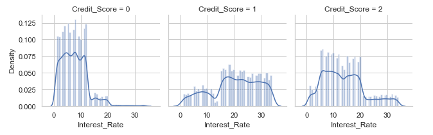

    The visualizations show the distribution of interest rates for customers segmented by their credit scores (Credit_Score = 0, 1, and 2).\
    For customers with a Credit_Score of 0, the interest rates are predominantly low, with most values concentrated in the range of 0–10%. This suggests that individuals in this group are likely considered low-risk borrowers who secure favorable interest rates.\
    Customers with a Credit_Score of 1 show a broader and more evenly distributed range of interest rates. The density peaks around 10–20%, indicating that a significant portion of this group is charged moderate interest rates. This group may represent borrowers with average creditworthiness.\
    For individuals with a Credit_Score of 2, the interest rates are more spread out, and the distribution is less sharply peaked compared to Credit_Score = 0. However, a significant proportion of these customers still experience interest rates ranging between 10–20%. This distribution reflects potentially higher-risk borrowers who might face diverse interest rates depending on other factors.
    
4.	Understanding the distribution of the column - Outstanding_Debt

    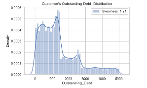

    This plot displays the density distribution of customers' outstanding debt.
    It is right-skewed with a skewness value of 1.21, as indicated in the legend. This suggests that most customers have lower outstanding debts, while fewer customers have significantly higher debts.\
    The density peaks around the lower range of outstanding debt (close to 0–1,000), with a gradual decline as the debt increases. Some outliers exist in the higher range of 4,000–5,000.

    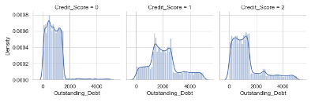

    These set of plots divides the Outstanding_Debt distribution based on Credit_Score values (0, 1, and 2).
    * Credit Score = 0: This group has a sharp density peak for lower outstanding debt (around 0–1,000). It shows that customers with poor credit scores tend to have lower outstanding debts, possibly due to limited access to credit or loans.
    * Credit Score = 1: The distribution is slightly more spread out compared to the Credit Score = 0 group. There are peaks around 1,000 and 2,000, indicating that customers with average credit scores have a moderate range of outstanding debts.
    * Credit Score = 2: This group exhibits a relatively wider distribution. Although there is a significant density in the lower range (0–1,000), the distribution shows more customers with higher outstanding debts (up to 3,000–4,000). This may indicate that customers with better credit scores have access to larger loans or higher credit limits.
    
    


### 5. Modelling:

In order to evaluate past data and forecast an individual's or company's creditworthiness, machine learning and deep learning approaches use sophisticated algorithms, which are critical to credit scoring. \
The results of various models have been evaluated using multiple metrics, including accuracy, precision, recall, F1-score, specificity, and AUC (Area Under the Curve). These metrics provide a holistic view of how each model performs, not just in terms of overall correctness (accuracy), but also in terms of its ability to correctly classify positive and negative instances (precision and recall) and its balance between these metrics (F1-score). Below is a detailed description of the models' performance.

1. Linear Discriminant Analysis (LDA)\

The Linear Discriminant Analysis (LDA) model demonstrates a moderate performance with an overall accuracy of 69.5%, indicating that it correctly classifies about 70% of the total instances. The model performs best for class 2, achieving the highest precision (0.75), recall (0.74), and F1-score (0.75), showing that it is most reliable in predicting this class. For class 1, the model achieves reasonable performance with a precision of 0.73 and a recall of 0.63, though it struggles to capture all instances, as reflected in the lower recall. Class 0, however, presents the greatest challenge, with the lowest precision (0.54) and F1-score (0.60), suggesting more frequent false positives and a struggle to balance precision and recall effectively. The macro and weighted averages of the metrics indicate a reasonable balance across all classes, but the model's ability to handle class imbalances could be improved. Overall, the LDA model is stable with a low cross-validation variance (+/- 0.005), but it has room for improvement, especially in distinguishing class 0.

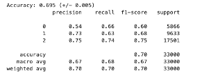

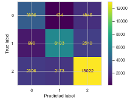

2. Gaussian Naive Bayes:

The Gaussian Naive Bayes (GaussianNB) model achieves an overall accuracy of 60.2%, indicating that it correctly predicts approximately 60% of the instances. The model shows notable performance disparities across the classes. It performs best for class 1, with a moderate precision of 0.63 and recall of 0.72, resulting in a balanced F1-score of 0.67. Class 0 has a relatively low precision (0.40) but a high recall (0.81), indicating that the model effectively identifies most instances of this class but often misclassifies other classes as class 0. Conversely, the model struggles with class 2, achieving the highest precision (0.79) but a low recall (0.46), suggesting that while the predictions for this class are often correct, many true instances of class 2 are missed. The macro average metrics indicate moderate balance across classes, but the weighted averages suggest a skew toward better performance for the more frequent classes. The model’s variance across cross-validation is low (+/- 0.006), demonstrating stability, but overall, its performance reflects limitations in handling class imbalances and distinguishing between the classes effectively.


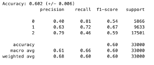

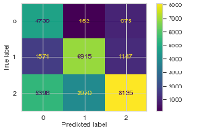

3.	Decision Tree Classifier:

The Decision Tree model demonstrates perfect performance with an overall accuracy of 100%. This means the model correctly classifies all instances in the dataset without any misclassification. The precision, recall, and F1-score for all three classes (0, 1, and 2) are consistently 1.00, indicating that the model identifies every instance of each class correctly and makes no false predictions. The macro and weighted averages also confirm flawless performance across the classes, signifying excellent handling of both balanced and imbalanced class distributions. While such results might seem ideal, they could indicate potential overfitting, particularly if the model is evaluated on the same data it was trained on. This warrants further validation on unseen data to confirm the robustness and generalizability of the model.

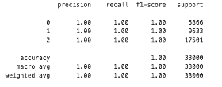

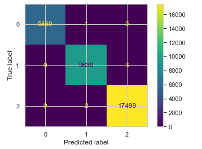

4.	Logistic Regression:

The Logistic Regression model shows varied performance across the three classes. For precision, the model performs well with class 1 (0.74) and class 2 (0.72), but less so for class 0 (0.59). In terms of recall, the model captures a higher proportion of class 2 instances (0.80), followed by class 1 (0.61), and class 0 with the lowest recall of 0.57. The F1-score, which balances precision and recall, is highest for class 2 (0.75), indicating the best overall performance for that class. The macro-average F1-score is 0.67, suggesting an overall reasonable balance between precision and recall across all classes, while the weighted average F1-score is 0.70, reflecting the model's tendency to perform better on the more frequent class 2. Overall, the model has an accuracy of 70%, which indicates a moderate level of correctness across all instances, with better performance on class 2 compared to the others.

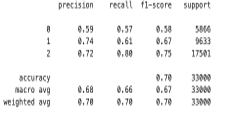

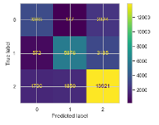

5.	K-Nearest Neighbors (k-NN)

The K-Nearest Neighbors (KNN) model demonstrates improved performance compared to the Logistic Regression model, with an accuracy of 72.9%, and a slight variation of +/- 0.004. For precision, the model performs best on class 2 (0.79) and class 1 (0.73), with class 0 showing the lowest precision (0.60). In terms of recall, class 0 performs better (0.67), followed by class 1 (0.74), and class 2 at 0.76. The F1-score is highest for class 2 (0.77), indicating a good balance between precision and recall for this class. Overall, the macro-average F1-score is 0.71, and the weighted average F1-score is 0.74, indicating that the model is consistently good across all classes, with a slight bias towards class 2. The KNN model, therefore, exhibits a well-rounded performance, with good precision and recall across most classes, especially for the more frequent class 2.

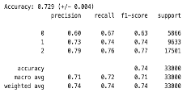

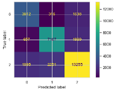

6.	Artificial Neural Network (ANN):

The Artificial Neural Network (ANN) model achieves an accuracy of 73.6%, with a slight variation of +/- 0.006. For precision, class 2 performs the best (0.75), followed by class 1 (0.76), and class 0 with the lowest precision (0.62). In terms of recall, class 2 again leads with 0.79, while class 1 has a recall of 0.72, and class 0 has the lowest recall at 0.57. The F1-score, which balances precision and recall, is highest for class 2 (0.77), followed by class 1 (0.74) and class 0 (0.60). The macro-average F1-score is 0.70, indicating a reasonable balance between precision and recall across all classes, while the weighted average F1-score is 0.73, reflecting the model's relatively stronger performance on class 2. Overall, the ANN model shows a solid performance, with good precision and recall, particularly for class 2, although there is room for improvement in capturing class 0.

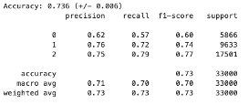

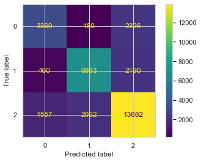


7.	Random Forest Classifier:

The Random Forest Classifier exhibits exceptional performance with an accuracy of 99.7%, demonstrating near-perfect predictions across all classes, with minimal variation (± 0.001). The precision, recall, and F1-score for all three classes (0, 1, and 2) are all reported as 1.00, indicating flawless classification performance for each class. This perfect performance holds for both the macro and weighted averages, with both metrics also being 1.00. The Random Forest model's near-perfect accuracy and balanced performance across all classes make it an outstanding choice for this task, with virtually no misclassifications.

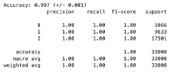

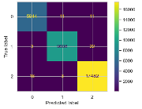

8.	XGBoost Classifier: 

The XGBoost model achieves a perfect performance with an accuracy of 100%, and no variation (± 0.000), indicating flawless predictions across all instances. The precision, recall, and F1-score for all three classes (0, 1, and 2) are all 1.00, signifying that the model makes no errors in classifying any of the instances. The macro and weighted averages also reflect perfect scores of 1.00, underscoring the model’s uniform excellence in handling all classes. With its perfect accuracy and flawless balance between precision and recall across all classes, the XGBoost model stands out as the top performer among the models tested.

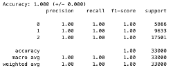

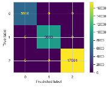

9.	Bagging Classifier:

The Bagging Classifier model also delivers a perfect performance with an accuracy of 100%, showing no variation (± 0.000). All precision, recall, and F1-score values for the three classes (0, 1, and 2) are 1.00, indicating that the model classifies every instance correctly without any errors. The macro and weighted averages of 1.00 further confirm that the Bagging Classifier handles all classes equally well, with flawless balance between precision and recall. This model demonstrates exceptional reliability and consistency in classification, matching the performance of other top models like Random Forest and XGBoost.

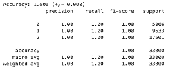

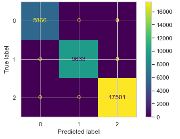


10.	AdaBoost Classifier:

The AdaBoostClassifier achieves perfect performance with an accuracy of 100%, showing no variation (± 0.000). All precision, recall, and F1-score values for each class (0, 1, and 2) are 1.00, indicating that the model makes no misclassifications across any of the classes. Both the macro and weighted averages are also 1.00, confirming that the AdaBoost model performs flawlessly and maintains perfect balance in its classification across all categories. This model is highly reliable, delivering flawless predictions similar to other top-performing models like Random Forest and XGBoost.


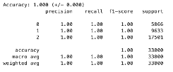

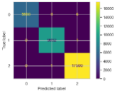

### 6.	Results and Discussion

#### 6.1	Discussion:

The performance of the various classification models reveals a clear distinction in terms of accuracy and how well each model handles different classes. Logistic Regression, with an accuracy of 70%, shows moderate performance overall but struggles with class 0, as evidenced by its lower precision (0.59) and recall (0.57) for this class. It performs better on class 2, with a recall of 0.80, but its overall effectiveness is limited by weaker performance on the less frequent classes. K-Nearest Neighbors (KNN) slightly outperforms Logistic Regression with an accuracy of 72.9%, achieving better recall for class 0 (0.67) and good precision for class 2 (0.79). This indicates that KNN is generally better at handling class 0 compared to Logistic Regression, while also maintaining solid performance across the other classes.\

The Artificial Neural Network (ANN) model, with an accuracy of 73.6%, offers a moderate improvement over KNN, showing good precision for class 1 (0.76) and class 2 (0.75). However, it still struggles with class 0, where recall drops to 0.57. Despite the increase in accuracy, ANN does not significantly outperform KNN in terms of class-specific performance, particularly for class 0. In contrast, ensemble models like Random Forest, XGBoost, Bagging Classifier, and AdaBoost demonstrate near-perfect performance, with 100% accuracy and flawless precision, recall, and F1-scores across all classes. These models consistently performed well for all classes, with perfect classification results, reflecting their robustness in handling imbalanced datasets and their ability to learn complex patterns effectively. The Decision Tree model also performed similarly, achieving perfect scores in all metrics, making it another top contender for high-accuracy classification tasks.

#### 6.2 Conclusion 

Recently, many studies have shed light on credit scoring, which has become one of the cornerstones of credit risk measurement. In this paper, we tried to identify the most important predictors of credit to construct machine learning and deep learning classifiers that identify people's good, standard, and poor credit scores would eventually help financial institutions and businesses make decisions based on credit scoring.\

In this study, we evaluated several classification models, including Logistic Regression, K-Nearest Neighbors (KNN), Artificial Neural Networks (ANN), Random Forest, XGBoost, Bagging Classifier, AdaBoost, Linear Discriminant Analysis (LDA), and Decision Trees, to assess their performance on a multi-class classification task. The results revealed that while simpler models like Logistic Regression, KNN, and ANN demonstrated moderate accuracy and class-specific performance, the ensemble models (Random Forest, XGBoost, Bagging Classifier, and AdaBoost) significantly outperformed them with near-perfect accuracy and flawless precision, recall, and F1-scores across all classes. These ensemble models proved to be the most reliable, consistently handling the complexities of the dataset and achieving robust classification results. The Decision Tree model also performed exceptionally well, achieving perfect scores similar to the ensemble methods.\

Ultimately, the results suggest that ensemble models, particularly Random Forest and XGBoost, are the best-performing models for this classification task, with their ability to capture intricate patterns and provide high accuracy across all classes. While simpler models like Logistic Regression and KNN can still be useful for less complex tasks or when interpretability is a priority, the advanced models are preferred for achieving the highest accuracy and robustness in multi-class classification problems.\

A possible limitation of this study is that we are only predicting the category of the credit score, which means if the credit score is good, poor, or standard. We are not calculating the actual credit score value. So, future research can perform the algorithms to calculate the credit score value. In addition to that, we have also yet to consider columns like Name and SSN, as these columns do not directly impact the project's outcome. However, future research could consider these columns for more specific information about the borrower.


### 7.	References

Abdou, H. & Pointon, J. (2011) 'Credit scoring, statistical techniques and evaluation criteria: a review of the literature ', Intelligent Systems in Accounting, Finance & Management, 18 (2-3), pp. 59-88. \

Abbasi, A. A., Hussain, L., Awan, I. A., Abbasi, I., Majid, A., Nadeem, M. S. A., & Chaudhary, Q.-A. (2020). Detecting prostate cancer using deep learning convolution neural network with transfer learning approach. Cognitive Neurodynamics, 14(4), 523–533. https://doi.org/10.1007/s11571-020-09587-5\

Aggarwal, N. (2021). The norms of algorithmic credit scoring. Cambridge Law Journal, 80(1), 42–73. \

Alshareef, A. M., Alsini, R., Alsieni, M., Alrowais, F., Marzouk, R., Abunadi, I., & Nemri, N. (2022). Optimal Deep Learning Enabled Prostate Cancer Detection Using Microarray Gene Expression. Journal of Healthcare Engineering, 2022, 1–12. https://doi.org/10.1155/2022/7364704\


Bao, W., Ning, L., & Kong, Y. (2019). Integration of unsupervised and supervised machine learning algorithms for credit risk assessment. Expert Systems With Applications, 128, 301–315. https://doi.org/10.1016/j.eswa.2019.02.033\

Ben-David, A., & Frank, E. (2009). Accuracy of machine learning models versus “hand crafted” expert systems – A credit scoring case study. Expert Systems With Applications, 36(3), 5264–5271. https://doi.org/10.1016/j.eswa.2008.06.071\

Bequé, A., & Lessmann, S. (2017). Extreme learning machines for credit scoring: An empirical evaluation. Expert Systems With Applications, 86, 42–53. https://doi.org/10.1016/j.eswa.2017.05.050\

Bhattacharya, I., Khandwala, Y. S., Vesal, S., Shao, W., Yang, Q., Soerensen, S. J. C., Fan, R. E., Ghanouni, P., Kunder, C. A., Brooks, J. D., Hu, Y., Rusu, M., & Sonn, G. A. (2022). A review of artificial intelligence in prostate cancer detection on imaging. Therapeutic Advances in Urology, 14, 17562872221128791. https://doi.org/10.1177/17562872221128791\


Chu, T. N., Wong, E. Y., Ma, R., Yang, C. H., Dalieh, I. S., & Hung, A. J. (2023). Exploring the Use of Artificial Intelligence in the Management of Prostate Cancer. Current Urology Reports, 24(5), 231–240. https://doi.org/10.1007/s11934-023-01149-6\

Dastile, X., Çelik, T., & Potsane, M. M. (2020). Statistical and machine learning models in credit scoring: A systematic literature survey. Applied Soft Computing, 91, 106263. https://doi.org/10.1016/j.asoc.2020.106263\

Ge, Y., Song, H., & Li, B. (2021). Bank loan strategy based on evaluation and decision model. Journal of Physics, 1865(4), 042018. https://doi.org/10.1088/1742-6596/1865/4/042018\

Hand, D. J., & Henley, W. E. (1997) Statistical classification methods in consumer credit scoring: a review on JSTOR. (n.d.). https://www.jstor.org/stable/2983268\


Hosseinzadeh, M., Saha, A., Brand, P., Slootweg, I., De Rooij, M., & Huisman, H. (2022). Deep learning–assisted prostate cancer detection on bi-parametric MRI: Minimum training data size requirements and effect of prior knowledge. European Radiology, 32(4), 2224–2234. https://doi.org/10.1007/s00330-021-08320-y\


Iqbal, S., Siddiqui, G. F., Rehman, A., Hussain, L., Saba, T., Tariq, U., & Abbasi, A. A. (2021). Prostate Cancer Detection Using Deep Learning and Traditional Techniques. IEEE Access, 9, 27085–27100. https://doi.org/10.1109/ACCESS.2021.3057654\

Kamimura, E. S., Pinto, A. R. F., & Nagano, M. S. (2023). A recent review on optimisation methods applied to credit scoring models. Journal of Economics, Finance and Administrative Science. https://doi.org/10.1108/jefas-09-2021-0193\

Khatir, A. a. H. A., & Bee, M. (2022). Machine Learning Models and Data-Balancing Techniques for Credit Scoring: What is the best combination? Risks, 10(9), 169. https://doi.org/10.3390/risks10090169\

Khosravi, P., Lysandrou, M., Eljalby, M., Li, Q., Kazemi, E., Zisimopoulos, P., Sigaras, A., Brendel, M., Barnes, J., Ricketts, C., Meleshko, D., Yat, A., McClure, T. D., Robinson, B. D., Sboner, A., Elemento, O., Chughtai, B., & Hajirasouliha, I. (2021). A Deep Learning Approach to Diagnostic Classification of Prostate Cancer Using Pathology–Radiology Fusion. Journal of Magnetic Resonance Imaging, 54(2), 462–471. https://doi.org/10.1002/jmri.27599\

Lessmann, S., Baesens, B., Seow, H., & Thomas, L. C. (2015). Benchmarking state-of-the-art classification algorithms for credit scoring: An update of research. European Journal of Operational Research, 247(1), 124–136. https://doi.org/10.1016/j.ejor.2015.05.030\


Linkon, A. H. Md., Labib, Md. M., Hasan, T., Hossain, M., & Jannat, M.-E.-. (2021). Deep learning in prostate cancer diagnosis and Gleason grading in histopathology images: An extensive study. Informatics in Medicine Unlocked, 24, 100582. https://doi.org/10.1016/j.imu.2021.100582\

Markov, A., Seleznyova, Z., & Lapshin, V. (2022). Credit scoring methods: Latest trends and points to consider. The Journal of Finance and Data Science, 8, 180–201. https://doi.org/10.1016/j.jfds.2022.07.002\


Mehralivand, S., Yang, D., Harmon, S. A., Xu, D., Xu, Z., Roth, H., Masoudi, S., Kesani, D., Lay, N., Merino, M. J., Wood, B. J., Pinto, P. A., Choyke, P. L., & Turkbey, B. (2022). Deep learning-based artificial intelligence for prostate cancer detection at biparametric MRI. Abdominal Radiology, 47(4), 1425–1434. https://doi.org/10.1007/s00261-022-03419-2\

Michaely, H. J., Aringhieri, G., Cioni, D., & Neri, E. (2022). Current Value of Biparametric Prostate MRI with Machine-Learning or Deep-Learning in the Detection, Grading, and Characterization of Prostate Cancer: A Systematic Review. Diagnostics, 12(4), 799. https://doi.org/10.3390/diagnostics12040799\

Onay, C., & Öztürk, E. (2018). A review of credit scoring research in the age of Big Data. Journal of Financial Regulation and Compliance, 26(3), 382–405. https://doi.org/10.1108/jfrc-06-2017-0054\

Padhani, A. R., & Turkbey, B. (2019). Detecting Prostate Cancer with Deep Learning for MRI: A Small Step Forward. Radiology, 293(3), 618–619. https://doi.org/10.1148/radiol.2019192012\

Patel, A., Singh, S. K., & Khamparia, A. (2021). Detection of Prostate Cancer Using Deep Learning Framework. IOP Conference Series: Materials Science and Engineering, 1022(1), 012073. https://doi.org/10.1088/1757-899X/1022/1/012073\

Qi, J., Rui-Cheng, Y., & Wang, P. (2021). Application of explainable machine learning based on Catboost in credit scoring. Journal of Physics, 1955(1), 012039. https://doi.org/10.1088/1742-6596/1955/1/012039\

Serrano‐Cinca, C., & Nieto, B. G. (2016). The use of profit scoring as an alternative to credit scoring systems in peer-to-peer (P2P) lending. Decision Support Systems, 89, 113–122. https://doi.org/10.1016/j.dss.2016.06.014\


Suarez-Ibarrola, R., Sigle, A., Eklund, M., Eberli, D., Miernik, A., Benndorf, M., Bamberg, F., & Gratzke, C. (2022). Artificial Intelligence in Magnetic Resonance Imaging–based Prostate Cancer Diagnosis: Where Do We Stand in 2021? European Urology Focus, 8(2), 409–417. https://doi.org/10.1016/j.euf.2021.03.020\

Tătaru, O. S., Vartolomei, M. D., Rassweiler, J. J., Virgil, O., Lucarelli, G., Porpiglia, F., Amparore, D., Manfredi, M., Carrieri, G., Falagario, U., Terracciano, D., De Cobelli, O., Busetto, G. M., Giudice, F. D., & Ferro, M. (2021). Artificial Intelligence and Machine Learning in Prostate Cancer Patient Management—Current Trends and Future Perspectives. Diagnostics, 11(2), 354. https://doi.org/10.3390/diagnostics11020354\


Teng, H., & Lee, M. (2019). Estimation procedures of using five alternative machine learning methods for predicting credit card default. Review of Pacific Basin Financial Markets and Policies, 22(03), 1950021. https://doi.org/10.1142/s0219091519500218\


Thenault, R., Kaulanjan, K., Darde, T., Rioux-Leclercq, N., Bensalah, K., Mermier, M., Khene, Z., Peyronnet, B., Shariat, S., Pradère, B., & Mathieu, R. (2020). The Application of Artificial Intelligence in Prostate Cancer Management—What Improvements Can Be Expected? A Systematic Review. Applied Sciences, 10(18), 6428. https://doi.org/10.3390/app10186428\

Turkbey, B., & Haider, M. A. (2022). Deep learning-based artificial intelligence applications in prostate MRI: Brief summary. The British Journal of Radiology, 95(1131), 20210563. https://doi.org/10.1259/bjr.20210563\

Van Booven, D. J., Kuchakulla, M., Pai, R., Frech, F. S., Ramasahayam, R., Reddy, P., Parmar, M., Ramasamy, R., & Arora, H. (2021). A Systematic Review of Artificial Intelligence in Prostate Cancer. Research and Reports in Urology, Volume 13, 31–39. https://doi.org/10.2147/RRU.S268596\

Vegh, L., Czakoova, K., & Takac, O. (2023). Comparing machine learning classification models on a loan approval prediction dataset. International Journal of Advanced Natural Sciences and Engineering Researches. https://doi.org/10.59287/ijanser.1516\

Vente, C. D., Vos, P., Hosseinzadeh, M., Pluim, J., & Veta, M. (2021). Deep Learning Regression for Prostate Cancer Detection and Grading in Bi-Parametric MRI. IEEE Transactions on Biomedical Engineering, 68(2), 374–383. https://doi.org/10.1109/TBME.2020.2993528\


Xia, Y., Liao, Z., Xu, J., & Li, Y. (2022). From credit scoring to regulatory scoring: Comparing credit scoring models from a regulatory perspective. Technological and Economic Development of Economy, 28(6), 1954–1990. https://doi.org/10.3846/tede.2022.17045\


Xu, D., Zhang, X., Hu, J., & Chen, J. (2020). A novel ensemble credit scoring model based on extreme learning machine and generalized fuzzy soft sets. Mathematical Problems in Engineering, 2020, 1–12. https://doi.org/10.1155/2020/7504764\

Yang, E., Shankar, K., Kumar, S., Seo, C., & Moon, I. (2023). Equilibrium Optimization Algorithm with Deep Learning Enabled Prostate Cancer Detection on MRI Images. Biomedicines, 11(12), 3200. https://doi.org/10.3390/biomedicines11123200

Zhang, R., & Qiu, Z. (2020). Optimizing hyper-parameters of neural networks with swarm intelligence: A novel framework for credit scoring. PLOS ONE, 15(6), e0234254. 
https://doi.org/10.1371/journal.pone.0234254\
